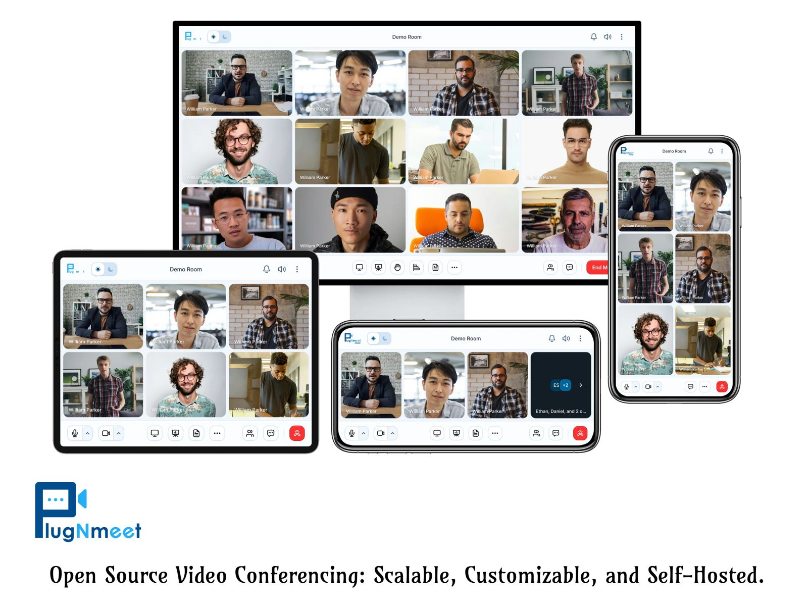

# Plug-N-Meet - A Scalable, Customizable, Open-Source Web Conferencing System

Plug-N-Meet is a powerful, open-source web conferencing solution built on the high-performance WebRTC infrastructure of [LiveKit](https://github.com/livekit/livekit-server). Designed for scalability and easy customization, Plug-N-Meet allows you to seamlessly integrate a feature-rich, self-hosted video conferencing experience into any existing website, application, or system.

Have questions or ideas? [Join our developer community on Discord](https://discord.gg/2X2ZaCHu4C) to connect with the team and discuss your suggestions.



## Key Features

*   **High-Performance & Scalable**: Built with Go and LiveKit, ensuring a robust system that can be distributed as a [single binary](https://github.com/mynaparrot/plugNmeet-server/releases).
*   **Adaptive Streaming**: **Simulcast** and **Dynacast** support ensures stable calls even on poor networks. Supported codecs include `H264`, `VP8`, `VP9`, and `AV1`.
*   **Rich Collaboration Tools**: Engage users with HD audio/video, screen sharing, virtual backgrounds, a collaborative whiteboard with office file support (PDF, DOCX, PPTX), shared notepad, polls, and breakout rooms.
*   **Secure Communication**: Features WebRTC-based encryption by default, with optional **End-to-End Encryption (E2EE)** for media and data channels (`Chromium 83+, Chrome, Edge, Safari, Firefox 117+`).
*   **Flexible Integration**: Easily integrate with any website or system using our straightforward API and SDKs.
*   **Deep Customization**: Easily customize the UI, features, branding, and URLs to match your application's look and feel.
*   **Advanced Features**: Includes MP4 recording, RTMP broadcasting, RTMP/WHIP ingress, a customizable waiting room, and detailed participant analytics.
*   **Accessibility**: Real-time speech-to-text and translation powered by Microsoft Azure.
*   **Cross-Device Compatibility**: Works on all modern browsers, including Chrome, Firefox, and Safari for iOS.

And many more!

## Core Components

1.  **plugNmeet-server**: The primary backend server written in **Go**, handling all API and business logic.
2.  **plugNmeet-client**: The main frontend interface built with **React** and **Redux**.
3.  **plugNmeet-recorder**: A dedicated Go application for managing MP4 recordings and RTMP broadcasting.

#### Demo

https://demo.plugnmeet.com/landing.html

## Installation
We've created a simple installation script to deploy all necessary components in minutes.

**View the Complete Installation Guide:** https://www.plugnmeet.org/docs/installation

## SDKs & Tools

### Official SDKs

*   [**PHP**](https://github.com/mynaparrot/plugNmeet-sdk-php)
*   [**JavaScript**](https://github.com/mynaparrot/plugNmeet-sdk-js) (for NodeJS and [Deno](https://github.com/mynaparrot/plugNmeet-sdk-js/tree/main/deno_dist))

### Ready-to-Use Plugins & Integrations

*   [**Joomla** Component](https://github.com/mynaparrot/plugNmeet-joomla)
*   [**Moodle** Plugin](https://github.com/mynaparrot/moodle-mod_plugnmeet)
*   [**WordPress** Plugin](https://github.com/mynaparrot/plugNmeet-wordpress)
*   [**LTI**](https://www.plugnmeet.org/docs/user-guide/lti) for any compatible LMS

### Docker Images

*   [plugnmeet-server](https://hub.docker.com/r/mynaparrot/plugnmeet-server)
*   [plugnmeet-etherpad](https://hub.docker.com/r/mynaparrot/plugnmeet-etherpad)
*   [plugnmeet-recorder](https://hub.docker.com/r/mynaparrot/plugnmeet-recorder)

Full server API documentation is available in the [API Docs](https://www.plugnmeet.org/docs/api/intro).

## Manual installation

**Requirements:**
1.  A properly configured **LiveKit** instance.
2.  **Redis** for caching and messaging.
3.  **MariaDB** or **MySQL** for data storage.
4.  (Optional) `libreoffice` & `mupdf-tools` for office file support in the whiteboard.

Create a `config.yaml` from the `config_sample.yaml` and modify it with your environment details.

***Using docker***

```
docker run --rm -p 8080:8080 \
    -v $PWD/config.yaml:/config.yaml \
    mynaparrot/plugnmeet-server \
    --config /config.yaml \
```

You can also
follow [docker-compose_sample.yaml](https://raw.githubusercontent.com/mynaparrot/plugNmeet-server/main/docker-compose_sample.yaml)
file.

You can manually download server from [release](https://github.com/mynaparrot/plugNmeet-server/releases) page too.

## Development

Please follow [this article](https://www.plugnmeet.org/docs/developer-guide/setup-development) for details.

## Contributing

We welcome your suggestions for improving plugNmeet!
Let's chat [on Discord](https://discord.gg/2X2ZaCHu4C) to discuss your suggestions and/or PRs. 
